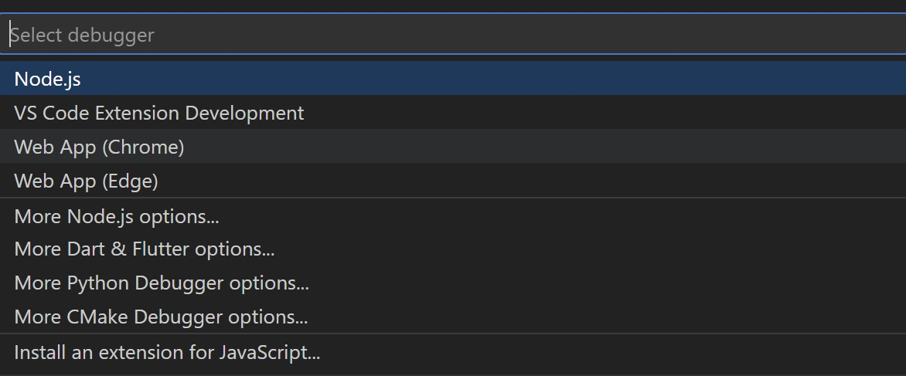
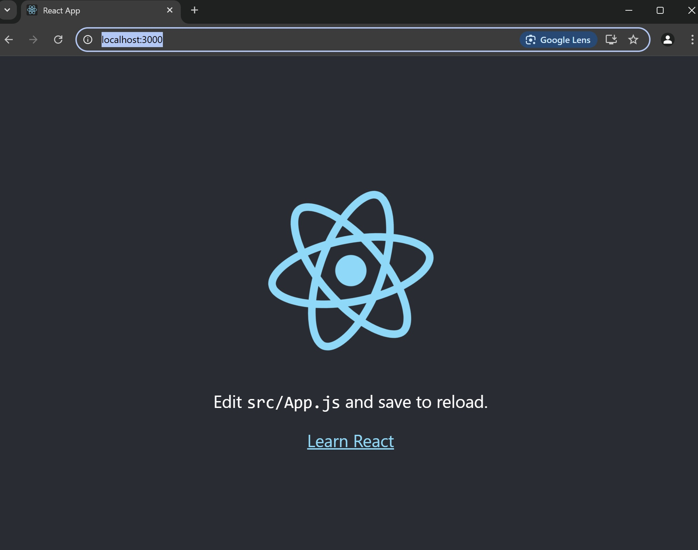

# ローカルサーバの確認

## 1. **ローカルサーバの構築**

以下のコマンドでローカルサーバを構築することができる．

```shell
$ npm start
```

## 2. **サーバアクセス**

[http://localhost:3000](http://localhost:3000)にアクセスしnodeサーバがローカルに構築されていることを確認する．

# JavaScript Debuggerのインストール

vscodeの拡張機能から`JavaScript Debugger`をインストールする．


# デバッグ構成

## 1. **Run And Debugをクリック**

サイドバーのRun And Debugをクリックし`Run and Debug`ボタンをクリック．

## 2. **デバッガの選択**

画面上部にポップアップが表示される．`Web App (Chrome)`を選択する．


## 3. **デバッガ構成**

デバッガを選択すると自動でlaunch.jsonが作成される．

localhostのポートに注意して，以下のように設定する．

```json
{
    // Use IntelliSense to learn about possible attributes.
    // Hover to view descriptions of existing attributes.
    // For more information, visit: https://go.microsoft.com/fwlink/?linkid=830387
    "version": "0.2.0",
    "configurations": [
        {
            "type": "chrome",
            "request": "launch",
            "name": "Launch Chrome against localhost",
            "url": "http://localhost:3000",
            "webRoot": "${workspaceFolder}"
        }
    ]
}
```

## 4. **デバッグ実行**

サイドバーのRun And Debugから`Start Debugging`をクリックするか，`F5`キーを押す．

以下のようにChromeの画面が表示されたら成功．

