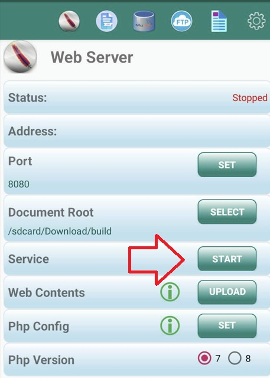
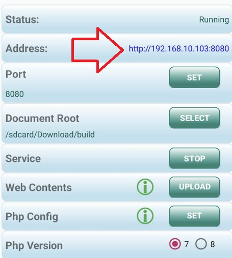
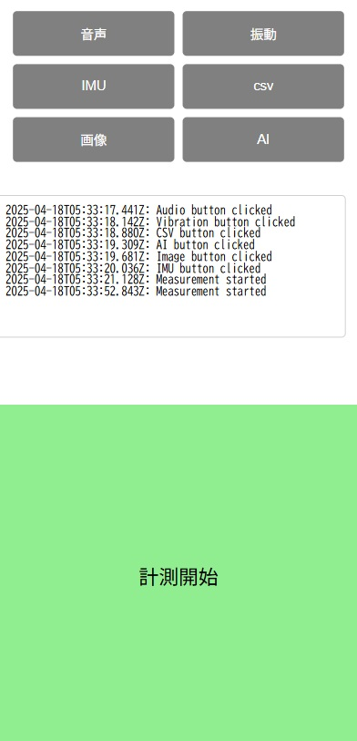

# ビルド

以下のコマンドをビルドする．

```shell
$ npm run build
```

`src`と同じ階層に`build`フォルダが作成されればビルド成功．

**Tips**
`build`フォルダはこの後の手順でも使用するため**スマートフォンにダウンロード**しておく．


# デプロイ

アプリケーションをスマホで実行するためにはローカルサーバを起動する必要がある．

ローカルサーバを起動するアプリケーションはGoogle StoreとiTunesで異なるため，それぞれで手順を分けて記載する．

## Androidにデプロイ

### 1. AWebServerのインストール

このアイコンのアプリケーションをインストールし，起動する．


### 2. ルートフォルダを設定

Document Rootにインストールした`build`フォルダのパスを指定する．


### 3. サーバ起動

Serviceの`Start`ボタンを押しローカルサーバを起動する．

数秒間広告が流れた後にサーバが起動したとポップアップがでる．



### 4. アプリ実行

AddressにURLが記載されている（例：http://192.168.10.103:8080）のでクリックする．



アプリケーションが実行されれば成功．




## iPhoneにデプロイ